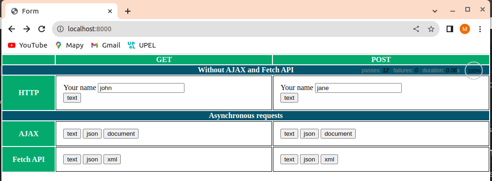

# JS-lab7
JavaScript course at AGH lab 7

## Overview
This project contains 2 server applications:
- lab6-app1.ts - a deno ts server application using express and pug packages.
- lab6-app1-oak.ts - a deno __ts__ server application using __oak__ and __ejs__ packages. 

## Packages and Tools
To run the project in VS Code, you will need following packages:
- deno

        curl -fsSL https://deno.land/x/install/install.sh | sh

- deno plugin

        code --install-extension denoland.vscode-deno     

- express pug morgan entities

        npm install express pug morgan entities

## Server Application lab6-app1.ts
Start your server as a standard deno.ts application from command-line:

    denon start-lab6

This application is the same as lab6 (https://github.com/msosnik/JS-lab6.git) but converted to __typescript__.
    
## Server Application lab6-app1-oak.ts
Start your server as a standard deno.ts application from command-line:

    denon start-lab6-oak

This application lab6-app1-oak.ts is exactly the same as lab6-app1 described in previous chapter but it uses __oak__ and __ejs__ (instead express and pug).

The server handles two routes:
- Route: GET "/" - displays UI
- Route: GET "/submit" - returns text/json/xml depending on `Accept` value in request header
- Route: POST "/submit" -  returns text/json/xml depending on `Accept` value in request header (same as GET /submit). `name` parameter is passed in request body (payload)

Example usage (open links in web browser)

    http://localhost:8000
    http://localhost:8000/submit?name=ala
    http://localhost:8000/submit?name=ola

Execute a POST using curl and passing `name` parameter in request body

    curl -X POST -d "name=ola" http://localhost:8000/submit
    curl -X POST -d "name=ola" http://localhost:8000/submit -H "Accept: application/json"
    curl -X POST -d "name=ola" http://localhost:8000/submit -H "Accept: application/xml"

## User Interface lab6-app1-oak.ts
Web UI is defined in EJS (Embedded JavaScript) HTML template. It can be accessed at main route: http://localhost:8000 as illustrated below.

